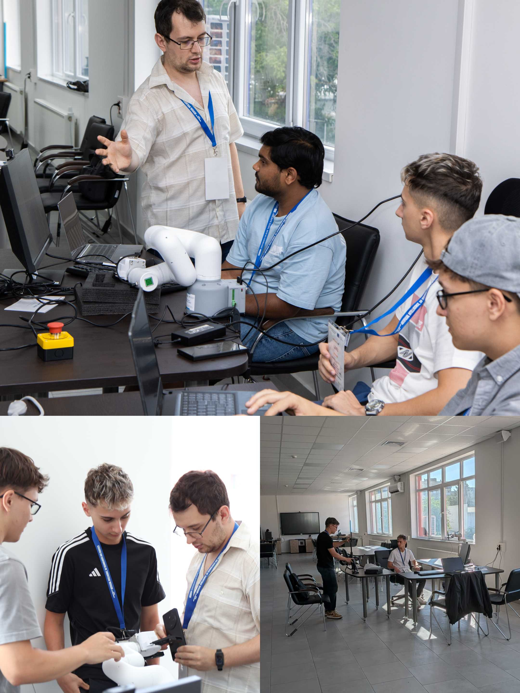
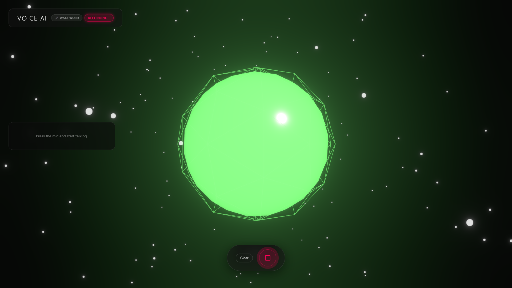
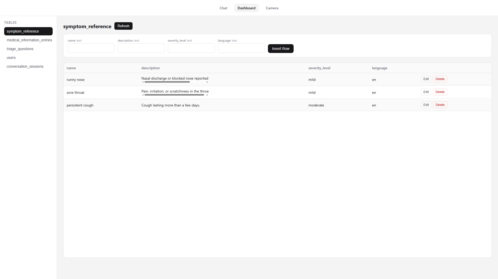

# 🤖 MIRA - <small>*<strong>M</strong>edical <strong>I</strong>ntelligent <strong>R</strong>etrieval <strong>A</strong>ssistant*</small>
<div align="center">

</div>

## 🏆 Project Context
<div align="left">


</div>

This project was developed during the **Erasmus+ Blended Intensive Programme (BIP)**, Project No. **2025-1-BG01-KA131-HED-000321310-3**, titled **"Enhancing Future Skills through Artificial Intelligence, 3D Technologies and Robotics"**, hosted by the **University of Ruse (Bulgaria)** between **6–10 July 2026**.
<br>
The solution was created through intensive teamwork, hands-on workshops, and project-based problem solving during the five-day programme.

## 🔍 Overview
Assistant designed for education and experimentation, combining conversational AI, Retrieval-Augmented Generation (RAG), voice interaction, robotics, and clinical learning scenarios.

## ⚙️ Tech Stack
<div align="left">

[](#)
[](#)
[](#)
[](#)
[](#)
[](#)

</div>

### Backend
- **FastAPI** - Modern Python web framework for building APIs
- **Domain-Driven Design (DDD)** - Clean architecture with clear separation of concerns
- **PostgreSQL/Neon** - Database for conversation memory and medical scenarios
- **pgvector** - Vector similarity search for semantic RAG
- **RAG System** - Custom retrieval system with 10+ clinical scenarios
- **OpenRouter/Groq** - LLM providers for intelligent responses
- **Whisper (faster-whisper)** - Offline speech-to-text conversion

### Frontend
- **React + WebGL** - Main 3D interface using Three.js and React Three Fiber
- **Angular** - Dashboard for testing, voice input, and database management

### Hardware
- **MyCobot 320** - Collaborative robot arm for physical interaction

## ✨ Features

### AI Assistant
- Context-aware medical conversations
- RAG-powered medical knowledge retrieval
- Emergency detection and escalation
- Persistent conversation memory

### Medical Education
- 10+ clinical scenarios
- Educationally focused responses
- Safety-first protocols

### Robotics
- Face tracking and following
- MyCobot 320 integration

## 🏗️ Architecture

```text
React + Three.js UI
          │
          ▼
      FastAPI API
          │
 ┌────────┼────────┐
 ▼        ▼        ▼
Whisper   RAG   PostgreSQL
 STT     Engine   + pgvector
          │
          ▼
      LLM Provider
   (Groq/OpenRouter)
          │
          ▼
      MyCobot 320
```

## 📸 Screenshots

### Team



### Frontend
 


### Dashboard


 
 
